# 목차

[레벨, 맵 디자인](https://watabou.itch.io/one-page-dungeon) 여기를 참조하면 좋다.

- [목차](#목차)
- [Unity_ActionRPG](#unity_actionrpg)
  - [프로젝트 설명](#프로젝트-설명)
    - [**1-1 rigidbody 이동,점프 및 대쉬**](#1-1-rigidbody-이동점프-및-대쉬)
    - [1-2. CharacterController를 이용한 이동](#1-2-charactercontroller를-이용한-이동)
    - [1-3. Character Controller 에 NavMesh 결합하기](#1-3-character-controller-에-navmesh-결합하기)
    - [캐릭터 모델링 및 애니메이션 구현](#캐릭터-모델링-및-애니메이션-구현)
    - [3. 카메라 에디터로 확장하기](#3-카메라-에디터로-확장하기)
    - [4. AI 구현 모델들을 알아보자(FSM,BehaviourTree).](#4-ai-구현-모델들을-알아보자) 	
  - [공부내용.](#공부내용)
    - [1. 정적 오브젝트](#1-정적-오브젝트)
    - [2. Vector \& transform](#2-vector--transform)
    - [3. Update, FixedUpdate, LateUpdate](#3-update-fixedupdate-lateupdate)
    - [4. RequireComponent](#4-requirecomponent)
    - [5. Light System](#5-light-system)
      - [light 세팅 팁](#light-세팅-팁)
      - [light probe](#light-probe)
      - [사용법](#사용법)
      - [reflextion probe](#reflextion-probe)
    - [6. Terrain System](#6-terrain-system)
    - [7. Navigation](#7-navigation)
    - [8. GetComponent에 대한 오해(나만...?)](#8-getcomponent에-대한-오해나만)

# Unity_ActionRPG

유니티로 ActionRPG(Diable등) 게임 제작하기

지금까지 유니티를 개인적으로 공부해왔지만, 하나같이 프로젝트를 직접 만들어보면서 해본것이라 간단한 컴포넌트 조차 제대로 짚고 넘어갈 기회가 없었다.
예를들어 rigidbody컴포넌트는 그동안 셀수없이 써봤지만 그 안에 Is Kinematic같은것은 정확히 어떤역할을 하는지 몰랐다.
이 참에 그동안 간과했던 하나하나 짚고 여기에 적어보려 한다.

**프로젝트 설명** 에는 프로젝트를 만들면서 사용한 기술, 코드의 큰 맥락등을 분석한것을 적을것이며,  
**공부내용** 에는 내가 그동안 무심코 지나치며 적용했던 것들을 적어보며 복습한다.

## 프로젝트 설명

움직임은 2가지 모두 구현해 놓았다

    1. rigidbody를 통한 움직임 [rigidbodyCharacter.cs](./ActionRPG/Assets/RigidBodyCharacter.cs)

    2. characterController를 통한 움직임
        [characterController.cs](./ActionRPG/Assets/ControllerCharacter.cs)

    3. NavMeshAgent를 이용한 캐릭터 제작 (+ CharacterController 와 조합해 확장)


보통의 게임에서는 간단한 플레이어 움직임은 물리엔진을 사용하지 않고 2번방식을 자주 사용한다.  
1,2 번은 키보드에 적합한 방식이고 Click & Move 방식에 적당한 방법은 3번 NavMeshAgent이다.  
우리는 디아블로같은 click & move 이동방식을 구현할것이라 3번으로 한다. 결과만 보려면 **1-3 Character Controller 에 NavMesh 결합하기**
만 확인한다.

**카메라의 기능을 굳이 Scene Editor로 확장한 이유는 추후 캐릭터에 AI를 추가한다던지 디버깅을 쉽게한다던지를 쉽게 확장하기위해 추가해보았다. 잘 익혀두자.**

---

### **1-1 rigidbody 이동,점프 및 대쉬**

rigidbody 컴포넌트 구성은 다음 링크를 참조한다  
[rigidbody 컴포넌트 구성](https://docs.unity3d.com/kr/2021.3/Manual/class-Rigidbody.html)

설명에 앞서 사용하는 변수명 및 초기값은 아래와 같다.

```csharp
    #region Variables
    public float speed = 5f;
    public float jumpHeight = 2f;
    public float dashDistance = 5f;
    private Rigidbody rb;
    private Vector3 inputDirection = Vector3.zero;  // 사용자의 입력에 대한 방향성을 계산하기위한 변수
    private bool isGround = false;                  // 땅에 닿아있는지 확인하기 위한 변수
    public LayerMask groundLayerMask;               // raycast를 통해 땅에 닿아있는지 확인하기 위한 변수
    public float groundCheckDistance = 0.3f;
    #endregion Variables
```

**이동** :

```csharp
    <--------- update 문 중 일부 --------->
    inputDirection = Vector3.zero;      // 초기화
    inputDirection.x = Input.GetAxis("Horizontal"); // 좌우에 대한 입력값
    inputDirection.z = Input.GetAxis("Vertical");   // 앞뒤에 대한 입력값
    if(inputDirection != Vector3.zero)
    {
        transform.forward = inputDirection; // transform.forward 는 앞쪽을 바라보는 방향으로 로컬 좌표계를 회전시킴.
    }
    <--------- update 문 종료 --------->

    <---------FixedUpdate문 중 일부 --------->
    rb.MovePosition(rb.position + inputDirection * speed * Time.fixedDeltaTime);
    <---------FixedUpdate 종료 ---------->

```

이동에 대한 설명은 밑쪽 공부내용 - 3,4번 항목을 참조한다  
**점프**:
rigidbody에서 jump는 Vector3.up 방향으로 점프값에 physics.gravity.y에 -2f를 곱해줬다 (physics.gravity.y 는 음수값) 게임마다 구현하는 방식이 다르므로 참조만 한다.

```csharp
    <--------- update 문 중 일부 --------->
    isGroundedCheck();
    if(Input.GetButtonDown("Jump") && isGround)
    {
        Vector3 JumpVelocity = Vector3.up * Mathf.Sqrt(jumpHeight * -2f * Physics.gravity.y); // 점프공식이다. 게임마다 구현방식이 다르다.
        rb.AddForce(JumpVelocity, ForceMode.VelocityChange); // 점프를 위한 힘을 가한다. VelocityChange는 힘을 가하는 방식이다.
    }
    <-------- update 문 종료 -------->
```

isGroundedCheck()는 아래와 같다.
isGroundedCheck()에서는 특정 LayerMask를 검출해 그것에 raycast가 닿으면 true반환, 아니면 false반환 하는 방식을 사용했다.

```csharp

    #region Helper Methods

    private void isGroundedCheck()
    {
        RaycastHit hit;

#if UNITY_EDITOR    // 유니티 에디터에서만 실행
    Debug.DrawLine(transform.position + (Vector3.up * 0.1f), // 시작점
        transform.position + (Vector3.up * 0.1f) + (Vector3.down * groundCheckDistance), // 시작점에서 땅방향으로 + groundCheckDistance(끝점)
        Color.red); // 색상

#endif

        if(Physics.Raycast(transform.position + (Vector3.up * 0.1f),    // 발에서 살짝 떨어뜨려서 raycast를 쏜다. 추후 발이 뭍히는 지형에서도 원활히 감지하기 위함
            Vector3.down,                                               // 아래 방향으로
            out hit,                                                    // hit에 정보를 담는다.
            groundCheckDistance,                                        // 땅에 어느정도 가까워 졌을때 감지할지
            groundLayerMask                                             // 땅에 대한 레이어마스크
        )) isGround = true;
        else isGround = false;


    }
    #endregion Helper Methods
```

**대시**:
대시에 대한 함수는 다음과 같다.

```csharp
    <--------- update 문 중 일부 --------->
    if(Input.GetButtonDown("Dash"))
    {
        Vector3 dashVelocity = Vector3.Scale(transform.forward,
            dashDistance * new Vector3(Mathf.Log(1f/(Time.deltaTime * rb.drag + 1 ))/ -Time.deltaTime,
            0,
            (Mathf.Log(1f/(Time.deltaTime * rb.drag + 1 ))/ -Time.deltaTime)
            )
        );
        rb.AddForce(dashVelocity, ForceMode.VelocityChange);
    }
    <--------- update 문 종료 --------->
```

여기선 dashVelocity를 구하는데 Vector3.Scale를 통해서 방향벡터를 스케일링 했다.
Vector3.Scale은 두개의 벡터를 받아서 각 구성요소를 곱한후 반환하는 것으로, 여기선 첫번째 인자로, transform.forward(사용자가 바라보는 방향)를 받아왔고, 이를 두번째 인자에 곱해 스케일링한다.
두번째는 스케일링할 벡터를 생성해 주었다. 스케일링할 벡터는 log를 분모로 하고 저항값을 가져와 1을 더한다거기에 deltaTime을 곱해줬다. 대시는 처음에 빨랐다가, 느려지는게 좋을거 같아서
저런식으로 구현했다. 다만 대시또한 게임마다 구현하는 방법이 다르므로 다른자료를 참조만 했다.

AddForce 의 두번째 인자는 ForceMode이다. 여기서는 ForceMode.VelocityChange를 사용했는데 이는 순간적으로 뒤에서 밀듯이 힘을 붙여주는것이다.  
이밖에도 엑셀을 밟듯 가속을하는 ForceMode.Force  
똑같이 가속을하지만 무게를 무시하는 ForceMode.Accelertion  
순간적으로 힘을주는 ForceMode.Impulse  
순간적으로 힘을주지만 무게를 무시하는 ForceMode.VelocityChange

---

### 1-2. CharacterController를 이용한 이동

CharacterController 에 대한 컴포넌트 구성은 다음 링크를 참조한다

[CharacterController 컴포넌트 구성](https://docs.unity3d.com/kr/2021.3/Manual/class-CharacterController.html)

** CharacterController 이동,점프 및 대쉬**

설명에 앞서 사용하는 변수명 및 초기값은 아래와 같다.

```csharp
    #region Variables
    public float speed = 5f;
    public float jumpHeight = 2f;
    public float dashDistance = 5f;
    private CharacterController characterController;
    private bool isGround = false;                  // 땅에 닿아있는지 확인하기 위한 변수
    public float gravity = -9.81f;
    public Vector3 drags;
    private Vector3 calcVelocity;
    #endregion Variables
```

이전 rigidbody와 다른점은 gravity 와 drags 를 직접 계산해 줘야한다는 것이다.
이러한 것들때문에 이동 점프 대시가 조금 구현이 rigidbody와 달라진다

**이동**

```csharp

<---------- update 문 일부----------->
      isGround = characterController.isGrounded;      // raycast가 아닌 characterController의 isGrounded를 사용한다.
        if(isGround && calcVelocity.y < 0) // 땅에있을때 더이상 중력값의 영향을 받지 않게함
        {
            calcVelocity.y = 0;
        }
        // Process Inputs

        Vector3 move = new Vector3(Input.GetAxis("Horizontal"), 0, Input.GetAxis("Vertical"));
        characterController.Move(move * speed * Time.deltaTime); // 캐릭터 컨트롤러를 이용한 이동
	(생략)
        calcVelocity.y += gravity * Time.deltaTime; // 중력값을 계산한다.

        calcVelocity.x /= 1 + drags.x * Time.deltaTime; // x축으로 이동할때마다 drags.x의 값만큼 속도를 줄인다.
        calcVelocity.z /= 1 + drags.z * Time.deltaTime; // z축으로 이동할때마다 drags.z의 값만큼 속도를 줄인다
        calcVelocity.y /= 1 + drags.y * Time.deltaTime; // y축으로 이동할때마다 drags.y의 값만큼 속도를 줄인다.

        characterController.Move(calcVelocity * Time.deltaTime); // 캐릭터 컨트롤러를 이용한 이동

```

characterController.isGrounded 라는게 있긴하지만, 아무래도 정밀도가 상당히 '많이' 떨어진다. 여기서는 학습용으로 사용했지만 다시
위 rigidbody에서 사용했던것처럼 raycast로 바꿀예정이다.

** 점프 **

```csharp
        if(Input.GetButtonDown("Jump") && isGround)
        {
            calcVelocity.y += Mathf.Sqrt(jumpHeight * -2f * gravity); // 점프공식이다. 게임마다 구현방식이 다르다.
        }
```

간단하다. 이동부분 마지막줄에 characterController.Move를 한번 더 해주는데 여기서 대시 및 점프를 해준다.

** 대시 **

```csharp
        if(Input.GetButtonDown("Dash"))
        {
            Vector3 dashVelocity = Vector3.Scale(transform.forward,
                dashDistance * new Vector3(Mathf.Log(1f/(Time.deltaTime * drags.x + 1 ))/ -Time.deltaTime,
                0,
                (Mathf.Log(1f/(Time.deltaTime * drags.z + 1 ))/ -Time.deltaTime)
                )
            );
            calcVelocity += dashVelocity;
        }

```

이것또한 세부 식은 rigidbody의 대시와 같기때문에 설명은 생략한다. 다른것이 있다면 , drags의 값을 public 변수로 받아서 사용한다는점,
calcVelocity에 더해준후 마지막에 이 값을 Move를 통해 처리해준다는 점이다.

---

### 1-3. Character Controller 에 NavMesh 결합하기

결합하기에 앞서 Window -> AI -> Navigation 을 눌러 아래 사진과 같은 세팅을 CharacterController 와 동일하게 변경해준다  
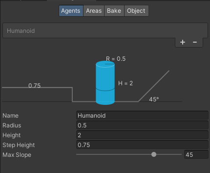
그 후 Object를 눌러 빌드를 할 오브젝트를 선택해준다  
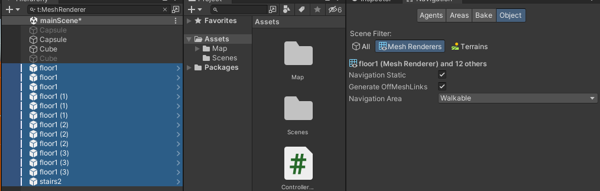

Generate OffMeshLinks : 점프, 순간이동들을 사용할수 있나 체크해줌. 도랑, 울타리등 특정조건이 있어야 지나갈 수 있을떄 체크해준다(일단 체크해제)  
Navigation Area : 영역을 설정하는 곳. 이동불가능한 부분(벽)은 Not Walkable로 해준다

이 후 bake를 선택해주고 , bake를 눌러준다  
더 세부내용은 추후 진행  
여기까지가 기본세팅이다. 그 후 캐릭터에 NavMeshAgent 컴포넌트를 추가해준다.  
NavMeshAgent의 컴포넌트 구성은 다음 링크를 참조한다.  
[NavMeshAgent 컴포넌트 세부구성](https://docs.unity3d.com/kr/2021.3/Manual/class-NavMeshAgent.html)

이제 우리는 키보드 입력이 아닌 Click & Move방식으로 구현할 것이다. 일단 사용할 변수는 다음과 같다.

```csharp
    #region Variables

    private CharacterController characterController;
    private bool isGround = false;                  // 땅에 닿아있는지 확인하기 위한 변수
    private Vector3 calcVelocity;
    private NavMeshAgent agent;
    private Camera camera;
    public LayerMask groundLayerMask;               // raycast를 통해 땅에 닿아있는지 확인하기 위한 변수
    public float groundCheckDistance = 0.3f;
    #endregion Variables

```

이제 점프등을 구현할 필요 가 없어졌으므로 gravity, drag등을 제거했다.
NavMeshAgent를 사용한다. 먼저 Start에서 다음과 같이 세팅해준다

```csharp
    void Start()
    {
        characterController = GetComponent<CharacterController>();
        agent = GetComponent<NavMeshAgent>();
        agent.updatePosition = false;           // NavMeshAgent가 자동으로 이동하지 않게함
        agent.updateRotation = true;            // NavMeshAgent가 자동으로 회전하게함

        camera = Camera.main;
    }
```

agent.SetDestination을 하면 자동으로 이동하지만... 우리는 이동처리는 CharacterController 로 할것이기 때문에 updatePosition을 false로 해준다.
Update문은 다음과 같이 변경해준다.

```csharp
    void Update()
    {
        if(Input.GetMouseButtonDown(0)) // 왼쪽 마우스 클릭
        {
            Ray ray = camera.ScreenPointToRay(Input.mousePosition); // 카메라에서 마우스 위치로 레이를 쏜다.
            RaycastHit hit;
            if(Physics.Raycast(ray, out hit, 100, groundLayerMask))      // physics.raycast 는 물체가 맞았으면 true를 리턴함
            {
                Debug.Log("We hit " + hit.collider.name + " " + hit.point);
                agent.SetDestination(hit.point);    // NavMeshAgent가 이동할 목적지를 설정한다.
            }
        }

        if(agent.remainingDistance > agent.stoppingDistance) // agent.remainingDistance 는 목적지까지 남은 거리를 리턴한다.
        {
            characterController.Move(agent.desiredVelocity * Time.deltaTime); // agent.desiredVelocity 는 목적지까지의 속도를 리턴한다.
        }
        else
        {
            characterController.Move(Vector3.zero);
        }
    }

```

구조는 되게 단순해졌다. 카메라에서 ray를 쏴서 ground 레이어에 닿으면 검출후 그곳을 목적지로 선택한다(위에서 updatePosition =true 하면 자동이동).
우리는 updatePosition 을 꺼놓았으므로, characterController.Move를 사용한다.

왜 자동이동을 꺼놨냐 하면 추후 장애물과 NPC를 피하면서 다른 충돌체와 작용할때 이것이 더 유리하다.

마지막으로 정확한 좌표값으로 이동해주기위해

```csharp
    private void LateUpdate()
    {
        transform.position = agent.nextPosition; // NavMeshAgent가 이동한 위치를 캐릭터의 위치로 설정한다.
    }
```

LateUpdate에서 클릭한 위치로 적용해준다.
결과는 다음과 같다

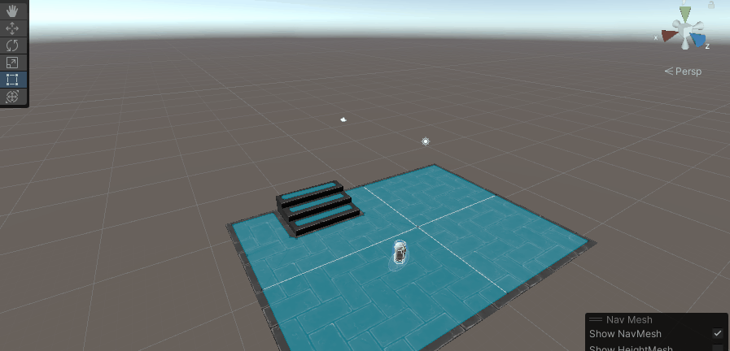

이동에 따른 카메라 이동코드는 다음 코드를 참조하면 된다
[카메라 이동 .cs](./Unity_ActionRPG/ActionRPG/Assets/Scripts/TopDownCamera.cs)

---

### 캐릭터 모델링 및 애니메이션 구현

먼저 [Mixamo](https://mixamo.com) 에서 무료 3D모델링을 다운받아준다.  
일단 Ybot Model과 Idle 애니메이션 3개, 이동 애니메이션 하나를 받았다.  
다운을 받고 난후, 프로젝트에 import 해준후, 기본 ybot을 클릭하면 Rig라는게 있는데,
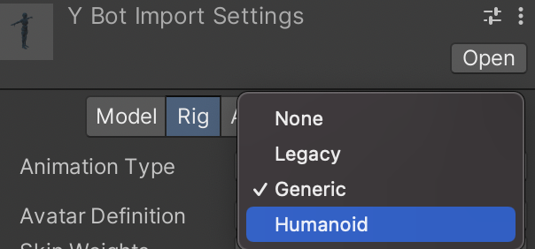 여기서 사람의 형태면 humanoid, 아니면 generic으로 설정해준다. Rig Tab에 대한 구성 설명은 아래 링크를 참조한다.  
[Rig Tab에 대해](https://docs.unity3d.com/kr/2021.3/Manual/FBXImporter-Rig.html)  
여기서 모바일게임과 같이 과부하가 적게 걸려야한다면 skin weight를 줄여주면 좋다. 이는 애니메이션을 할때 각 vertex가 주변의 몇개의 뼈에 영향을 받을것인가 설정해주는것이므로, 많을수록 과부하가 높다.  
그리고 Import Setting -> animation -> apply 를 눌러주면 적용이 된다.

그 이후 나머지 Idle과 Walk는 아래같이
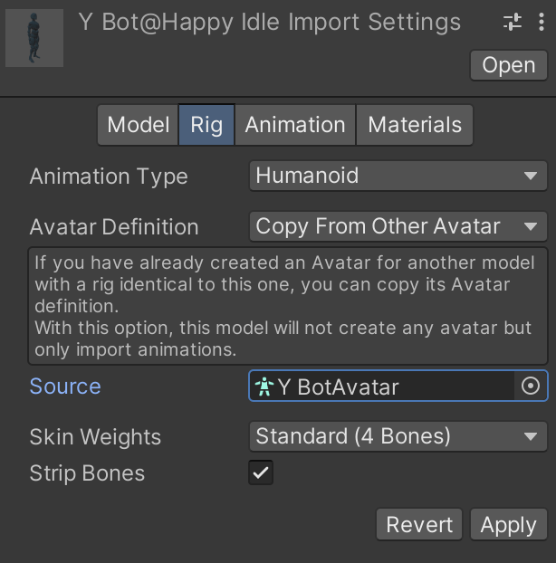  
** Avartar Definition 을 copy from other avatar을 설정해주고, source는 ybot 기본모델에 있는 ybotAvatar을 사용해준다. ** <- 이게 중요하다. 애니메이션을 붙여줄 아바타(모델)을 해준다.  
아래같이 붙인 아바타에따라 애니메이션이 적용되는 대싱이 달라진다.
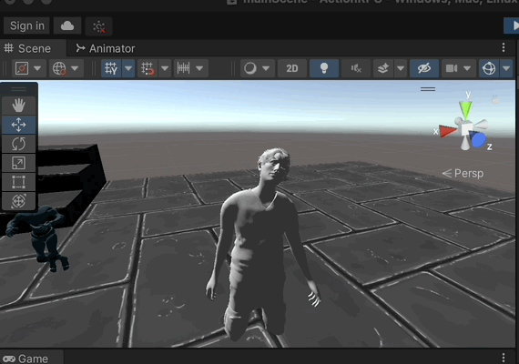<- Test  
위 gif와 같이 Humanoid 에 아바타 내부 구조만 같으면 다른 모델에 Ybot애니메이션을 적용해도 잘 작동한다.

유니티 아바타에 대해선 아래를 참조하되 [유니티 아바타(영문)](https://docs.unity3d.com/Manual/ConfiguringtheAvatar.html) 아무래도 제대로 이해하려면 직접 해봐야 할거같으므로
이번 프로젝트 말미쯤에 따로 다뤄보자

이제 다운받은 모델 & 애니메이션을 적용해보자.
구조는 다음 두장의 이미지와 같다.  
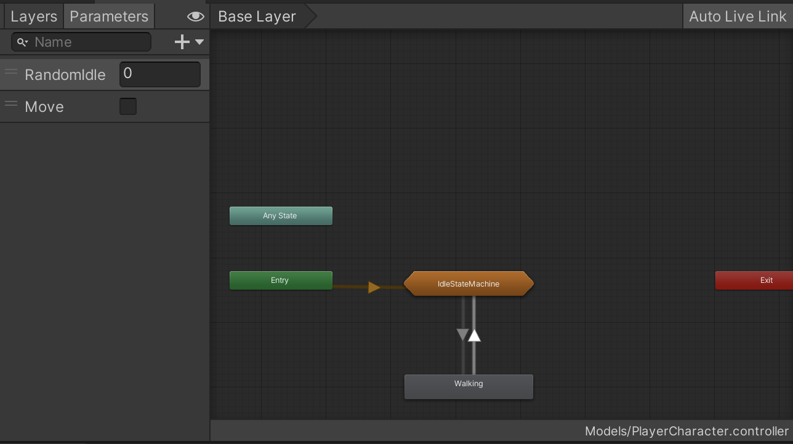 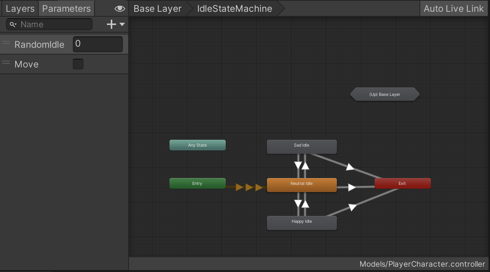

Base Layer애 Sub-State Layer 와 MoveAnimation을 추가해줬다.  
Sub-State Layer에서는 3가지의 Idle을 랜덤 출력해준다. 3가지중 Entry로 들어오는 Animation에서 Add Behaviour를 눌러서 스크립트를 추가해준다.  
사용하는 변수는 아래와 같다

```csharp
    #region Variables
    public int numberOfStates = 3; // 기본상태를 제외한 상태의 개수
    public float minStateTime = 0f;
    public float maxStateTime = 5f;
    public float randomNormalTime;
    readonly int hashRandomIdle = Animator.StringToHash("RandomIdle");  // 스트링보다 빠른 해시값을 사용한다.
    #endregion Variables
```

이 변수들은 먼저 OnStateEnter에서 애니메이션 탈출시간을 Random으로 설정해준다.

```csharp
    override public void OnStateEnter(Animator animator, AnimatorStateInfo stateInfo, int layerIndex)
    {
        randomNormalTime = Random.Range(minStateTime, maxStateTime);
    }

```

이 랜덤으로 설정해준 randomNormalTime은 아래에서 OnStateUpdate에서 사용해준다

```csharp
    override public void OnStateUpdate(Animator animator, AnimatorStateInfo stateInfo, int layerIndex)
    {
       if(animator.IsInTransition(0) && animator.GetCurrentAnimatorStateInfo(0).fullPathHash == stateInfo.fullPathHash)
       // 만약 base layer(0번레이어)에 있거나, 현재 재생 중인 애니메이션 상태의 fullPathHash가 stateInfo로 지정된 애니메이션 상태의 fullPathHash와 동일하다면
       // fullPathHash 는 고유 식별자이다.
       // 즉 베이스레이어에 있으며 현재상태의 이름과 (0번 레이어)의 경로가 같으면 들어와있지 않은것
       {
            animator.SetInteger(hashRandomIdle, -1);
       }
       if(stateInfo.normalizedTime * 2> randomNormalTime && !animator.IsInTransition(0))
       {
            // Debug.Log(stateInfo.normalizedTime);    // 보니까 이거 실제 시간이 아니라 애니메이션의 정규화된 시간이다.
            animator.SetInteger(hashRandomIdle, Random.Range(0,numberOfStates));
       }
    }
```

특이사항은 animator.SetInteger해줄때 첫번째 인자에 string을 넣어주지 않고, 위에서 선언한 readonly int hashRandomIdle 을 넣어줬는데 이는, string으로 처리하는것보다 int해시 값으로  
변환해서 하는것이 처리속도 측면에서 훨신 빠르기 때문이다.

움직이는 함수는 기존 CharacterController에 SetBool만 추가해준다.

```csharp
    <--------- 변수추가 --------->
    private Animator animator;
    readonly int moveHash = Animator.StringToHash("Move");
    <-------------------------->

    <---------CharacterController Update ---------->
    if(agent.remainingDistance > agent.stoppingDistance) // agent.remainingDistance 는 목적지까지 남은 거리를 리턴한다.
    {
        characterController.Move(agent.desiredVelocity * Time.deltaTime); // agent.desiredVelocity 는 목적지까지의 속도를 리턴한다.
        animator.SetBool(moveHash, true);
    }
    else
    {
        characterController.Move(Vector3.zero);
        animator.SetBool(moveHash, false);
    }
    <---------------------------------------------->
```

해당 결과는 아래와 같다

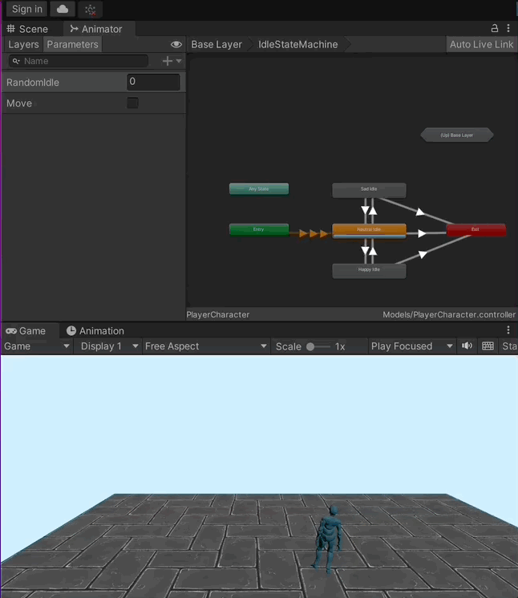

### 3. 카메라 에디터로 확장하기

이전에 만든 카메라 코드가 하나 있다

```csharp
        public void HandleCamera()
        {
            if(!Target) return;

            // 카메라의 월드포지션 계산.
            Vector3 worldPosition = (Vector3.forward * -distance) + (Vector3.up * height); // 타겟 뒤쪽을 잡기위해 farword의 distance를 곱해주고, 위로 height만큼 올려준다.
            Vector3 rotatedVector = Quaternion.AngleAxis(angle, Vector3.up) * worldPosition; // AngleAxis는 각도와 축을 받아서 회전시키는 함수
            Vector3 finalTargetPosition = Target.position;
            finalTargetPosition.y += lookAtHeight; // 캐릭터의 머리를 바라보게 하기 위해 높이를 더해준다.
            Vector3 finalPosition = finalTargetPosition + rotatedVector;
            Vector3 smoothedPosition = Vector3.Lerp(transform.position, finalPosition, smoothSpeed);
            transform.position = smoothedPosition;
            transform.LookAt(Target.position);  // 카메라가 타깃의 포지션을 바라보게함
        }
```

이 코드는 카메라가 사람을 부드럽게 따라다니도록 만들어준 코드였다. 하지만 단점이 있었는데, Inspector창에서 하나하나 수치값을 맞춰 주기에는 힘들다는 점이었다.  
이를 Editor를 이용해 Scene에서 쉽게 조정할 수 있게하고, 덧붙여 Scene에서 더욱 카메라의 정보를 쉽게 알아볼 수 있게 만들것이다.  
해당 코드는 게임실행중 돌아가는 코드가 아니므로, Monobehaviour가 아닌 Editor를 상속한다.  
코드 전문을 한번 보자

```csharp
namespace JS.Cameras{
    [CustomEditor(typeof(TopDownCamera))]
    public class TopDownCamera_Editor : Editor
    {
        #region Variables
        private TopDownCamera targetCamera;
        #endregion Variables

        public override void OnInspectorGUI()
        {
            targetCamera = (TopDownCamera)target; // target은 editor제공해주는 변수로 현재 인스펙터에 있는 컴포넌트를 가리킨다.
            base.OnInspectorGUI();  //이거 호출안하면 Inspector에 추가안됨.
        }


```

**OnInspectorGUI : 선택한 오브젝트가 인스펙터 윈도우에 표시될때 호출되는 함수**
**OnSceneGUI : 선택한 오브젝트가 Scene상에서 표시되게함.**  
먼저 OnInspectorGUI에서는 TopDownCamera라는 스크립트를 가진 GameObject대상으로 한다고 선언해준다.  
즉 선택된 스크립트나 컴포넌트를 TopDownCamera 클래스의 인스턴스로 형변환하여 targetCamera 변수에 저장한다.

우리가 주로 사용할 것은 아래의 OnSceneGUI이다.

```
        private void OnSceneGUI()
        {
            if(!targetCamera || !targetCamera.Target) return;

            Transform cameraTarget = targetCamera.Target;   // 타겟의 트랜스폼을 가져온다.
            Vector3 targetPosition = cameraTarget.position; // 타겟의 포지션을 가져온다.
            targetPosition.y = targetCamera.lookAtHeight;   // 타겟의 높이를 가져온다.

            Handles.color = new Color(1f,0f,0f,0.15f);    // 핸들의 색상을 설정한다. (빨간색)
            Handles.DrawSolidDisc(targetPosition, Vector3.up, targetCamera.distance);

            Handles.color = new Color(0f,1f,0f,0.75f);    // 핸들의 색상을 설정한다.
            Handles.DrawWireDisc(targetPosition, Vector3.up, targetCamera.distance);

            Handles.color = new Color(1f,0f,0f,0.5f);
            targetCamera.distance = Handles.ScaleSlider(targetCamera.distance, targetPosition, -cameraTarget.forward, Quaternion.identity, targetCamera.distance, 0.1f);

            targetCamera.distance = Mathf.Clamp(targetCamera.distance, 2f, float.MaxValue);    // 2f~ float가 가질수 있는 최대값사이의 값으로 제한.

            Handles.color = new Color(0f,1f,0f,0.5f);
            targetCamera.height = Handles.ScaleSlider(targetCamera.height, targetPosition, Vector3.up, Quaternion.identity, targetCamera.height,0.1f);

            targetCamera.height = Mathf.Clamp(targetCamera.height, 2f, float.MaxValue);    // 2f~ float가 가질수 있는 최대값사이의 값으로 제한.

            GUIStyle labelStyle = new GUIStyle();
            labelStyle.fontSize = 15;
            labelStyle.normal.textColor = Color.white;
            labelStyle.alignment = TextAnchor.MiddleCenter;

            Handles.Label(targetPosition +(-cameraTarget.forward * targetCamera.distance), "Distance", labelStyle);

            labelStyle.alignment = TextAnchor.MiddleRight;
            Handles.Label(targetPosition + (Vector3.up * targetCamera.height),"Height", labelStyle);

            targetCamera.HandleCamera();
        }
    }
}

```

먼저 위에서 가져온 cameraTarget을 가져오고 변수를 만들어 cameraTarget에 저장해주고 position정보를 targetPosition이라는 Vector3에 저장해준다.
그후 현재 카메라의 높이를 가져와서 targetPosition.y에 넣어준다.

먼저 카메라와 떨어진 거리를(distance) 반지름으로하는 디스크를 카메라 끝에 넣어주고, 그 색을 0.15f의 alpha값을 가진 빨간색에 넣어준다
그 밑에도 DrawWireDisc(원모양인데 테두리만)를 같이 추가해준다.

다음은 distance와 Height를 Scene에서 쉽게 바꿔줄수있게 grabbable 할수있는것을 추가해준다.
그게 Handles.ScaleSlider이다.  
여러개의 매개변수를 받는데 이는 다음과 같다.

- value: 슬라이더의 현재 값. 이 값은 슬라이더를 조작하여 변경된다. 이 경우 targetCamera.distance& targetCamera.heught가 현재 값으로 사용된다.
- position: 슬라이더가 표시될 위치. 슬라이더 핸들이 이 위치에 나타낸다.
- direction: 슬라이더가 조작될 방향. -cameraTarget.forward는 카메라 타겟(character)의 정면 방향을 나타내고, Vector3.up는 타켓의 윗방향으로 슬라이더가 움직이게 된다
- rotation: 슬라이더 핸들의 회전을 정의하는 Quaternion. Quaternion.identity는 회전을 적용하지 않는 것을 의미한다.
- sliderMin: 슬라이더의 최소 값이다.
- sliderMax: 슬라이더의 최대 값이다.

그 이후 코드들은 슬라이더에 문구를 달아주는것이다.

결과는 다음과 같다  


### 4. AI 구현 모델들을 알아보자.

#### 1-1 FSM(Finite State Machine)  
상태의 흐름을 나타내고 제어하는것. 상태의 전환 즉 transition을 직관적으로 나타낸다. 한번에 하나의 상태만 수행할 수 있으므로, 다음 상태를 수행하려면 이전 상태를 종료해야한다.  
FSM Machine은 처음에 초기화를 하면서 State Machine에 상태들을 등록하는 것으로 시작한다. 그후 초기상태에서 시작한 이후, AI를 수행하며 각 state machine에서 transition을 수행한다.  
아래부터는 C# 의 Generic문법을 활용해 FSM을 구현 할 것이다.  
https://github.com/pgs2285/Unity_ActionRPG/blob/8f13a63b90fc461f89f762df23f6b0264484489d/ActionRPG/Assets/Scripts/StateMachine_New.cs#L1-L78  
이제 위에서 구현한 FSM 모델을 가지고 캐릭터 AI를 구현해보자.  
먼저 구현하고 싶은 몬스터와 애니메이션을 구해주고 animator를 알아서 구성해주자. 위에서 만든 FSM을 이용해 State를 등록할것이다.   
**해당 State는 위 FSM을 상속하고 Update, OnEnter, OnExit... 등을 구현해(virtual, abstract라서 상속시 구현해야함) 원하는 상황일때 바꿔줄 것이다.** 아래는 구현중 일부인 IdleState에 대한 예시이다.  
https://github.com/pgs2285/Unity_ActionRPG/blob/0fed87957cb04254b0e48701e259ebbf8e8b297a/ActionRPG/Assets/Scripts/AI(FSM)/IdleState.cs#L5-L46
> **이후 세부코드들은 Scripts/AI(FSM)/*을 참조한다.**

결과는 다음과 같다.  


#### 1-2 Behaviour Model  
AI가 행동에따른 결정흐름을 직관적으로 나타내기 가능. 행동에 대한 모델이 state가 아닌 task로 이루어져 있다. 각 노드는 task이며 부모와 자식으로 구성된 tree로 표현이 된다.  
제어 흐름이 왼쪽에서 오른쪽으로 간다.  
behavior tree의 node는 크게 4가지로 나눌수있다.

> 1.selector : 자식중 하나를 선택해서 수행한다.  
> 2. sequence : 자식들을 순차적으로 수행한다.  
> 3. decorator : if문처럼 조건을 활용해 상태를 제어한다.  
> 4. execution : 구체적으로 구현된 함수를 호출한다.  
> decorator 에서 failure를 반환하면 behaviour tree의 실행이 종료된다. (특정 구간에서 failure 반환하고 selector 처럼 대체노드가 있는 상황이 아니면 종료된다.)

#### 1-3 시야(Field Of View) 구현하기  
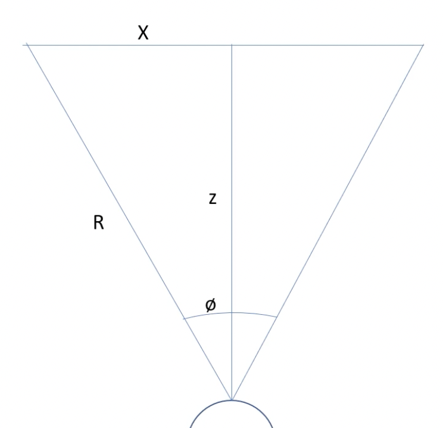  
캐릭터의 시야를 구현하기 위해서 새로운 스크립트를 생성해준다.  
스크립트는 아래와 같다.  
https://github.com/pgs2285/Unity_ActionRPG/blob/f4c4f19943198bf820b67c75cf400b263eec6a53/ActionRPG/Assets/Scripts/AI(FSM)/FieldOfView.cs#L5-L61  
주석으로 적어두었지만, 다시한번 간단하게 분석하자면, 현재 캐릭터 주변으로 감지할 범위만큼의 Sphere을 생성해주고, 타겟과 나의 방향벡터를 구한다.  
그 후 Vector3.Angle을 통해서 viewRadius / 2 만큼의 각도 내에 있는지 확인한다.  
위 이미지 처럼 자기 중심을 기준으로 좌우 절대값의 각도를 구해 비교하기 위해선, viewRadius / 2가 필요하다.  
마지막으로 타겟에게 Ray를 쏴서 만약 중간에 Obstacle Layer가 검출되지 않으면 내 시야각에 있는 Object이므로 List에 추가해주면 끝난다.  
에디터를 구현하는 과정에서 sin, cos등을 이용해 좌표값을 구하는 과정을 통해 수학의 중요성을 알게되더라...   
https://github.com/pgs2285/Unity_ActionRPG/blob/459f258c407ce3ca93ed3cf873a8a66d3f60adaf/ActionRPG/Assets/Scripts/AI(FSM)/FieldOfView_Editor.cs#L4-L40 
sin,cos로 좌표를 구하기만하고 사용하지 않은것은 방향벡터를 구해서 반지름을 곱해주는 방식이 더 낫다 생각했기 때문에 좌표만 연습삼아 구해본것이다.  
실제 DirFromAngle은 *new Vector3(Mathf.Sin( angleInDegree * Mathf.Deg2Rad), 0, Mathf.Cos(angleInDegree * Mathf.Deg2Rad));* 을 return한다.  
최종적으로 구현한 FOV는 다음과 같다. 이전에 위에서 보여준 gif와 다른점은 설정한 시야각 범위에 들어와있을때만 추적한다는 점, 장애물 뒤에 숨으면 추적을 멈춘다는 점이다.  

  

#### 1-4 Patrol 상태의 적 만들기(확장)  
먼저 기존의 EnemyController에 이동할 위치를 찾는 함수를 만들어주자.  
```csharp
# Assets/Scripts/AI(FSM)/EnemyController_Ghoul.cs : L64-74
    public Transform FindNextWayPoint()
    {
        wayPointTarget = null;
        if(waypoints.Length > 0)
        {
            wayPointTarget = waypoints[wayPointIndex];
        }

        wayPointIndex = (wayPointIndex + 1) % waypoints.Length;  //cycling
        return wayPointTarget;
    }
```  
그후 새로운 State를 제작해서 상태에 등록해준다.    
https://github.com/pgs2285/Unity_ActionRPG/blob/357c5c16fc51f51d22564bb6b4ee846af0acc0ee/ActionRPG/Assets/Scripts/AI(FSM)/MoveToWayPoints.cs#L6-L70
결과는 아래와 같다. 적은 특정 구간을 배회하다가, 캐릭터를 발견하면 쫒아오고(공격), 시야에서 벗어나면 다시 Patrol상태로 돌아간다.  
  


## 공부내용.

#### 1. 정적 오브젝트

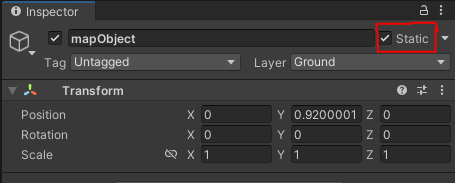
ground 와 같이 움직이지 않는것들은 static을 표기해주는 것이 좋다. 이는 정적 오브젝트가 포지션 변화로 인해 무효화 될일이 없다는것을 체크해주는것으로,
여러 정적 오브젝트들을 배치(batch) 라는 하나의 큰 오브젝트로 결합시킴으로서 렌더링을 최적화 할수 있다.(정적 최적화)
필요에 따라 static옆에 화살표를 눌러 원하는 정적 상태를 (활성화/비활성화) 시킬수 있다. 이는 아래 링크 참조.

[정적 게임 오브젝트, 정적 설정에 대한 설명](https://docs.unity3d.com/kr/530/Manual/StaticObjects.html)

---

#### 2. Vector & transform

보통 우리가 사용하는 Vector3.forward 와 transform.forward를 예시로 든다. 굳이 forward에 국한되지 않고 .up, .back등에도 쓴다.
Vector3.forward는 new Vector(0,0,1) 이 기본이다. 이것은 Read-Only Value기 때문에 바꿀수 없다.
transform.forward는 현재 오브젝트를 기준으로 한다. 보통 3D에서 물체가 바라보는 방향을 바꿔주고싶으면

```csharp
        inputDirection = Vector3.zero;      // 초기화
        inputDirection.x = Input.GetAxis("Horizontal"); // 좌우에 대한 입력값
        inputDirection.z = Input.GetAxis("Vertical");   // 앞뒤에 대한 입력값
        if(inputDirection != Vector3.zero)
        {
            transform.forward = inputDirection; // transform.forward 는 앞쪽을 바라보는 방향으로 로컬 좌표계를 회전시킴.
        }
```

와 같이 사용하곤한다.
즉 사용 용도가 완전히 다르다.

---

#### 3. Update, FixedUpdate, LateUpdate

~ Update - 매 프레임마다 처리되는 작업이다. 때문에 그래픽 랜더링 속도에 따라 느려지거나 빨라지고 있어서, 원하지않은 물리적 충돌이 발생할 수 있다.
~ FixedUpdate - 물리엔진 위에서 동작한다. 즉 고정된 시간마다 실행하는데 이때문에 보통 이동,회전,힘에서 사용한다.
~ LateUpdate - Update문 호출이되고 가장 마지막에 호출되는 문이다

보통 이 3가지 조합을 합쳐서
입력은 Update, 이동처리는 FixedUpdate, 카메라 움직임은 LateUpdate에 구현해주면 보다 부드럽게 구현 할 수 있다.

---

#### 4. RequireComponent

스크립트에서 유용하게 사용할 수 있는 기능이다. 만약 한 GameObject에 스크립트를 추가한것 만으로 필요한 컴포넌트등을 추가해주고 싶다면,

```csharp
[RequireComponent(typeof(CharacterController)), RequireComponent(typeof(NavMeshAgent)), RequireComponent(typeof(Animator))]
public class ControllerCharacter : MonoBehaviour {...}
```

이렇게 해주면 나중에 ControllerCharacter만 불러오더라도 , RequireComponent에 적은 모든 컴포넌트를 불러올 수 있다.

#### 5. Light System

화면에 빛들은 Direct Light + Undirect Light를 합쳐서 우리들 눈에 보여진다.  
하지만 유니티에서는 이러한 연산을 계속한다면 과부하가 심하기 때문에 Texture에 저장을 해서 사용한다. 이를 Lightmap 기법이라고 한다.  
Unlit(빛의 영향을 받지않는 쉐이더) + Lightmap을 헤주면 빛의 영향을 받는 결과가 나온다. 즉 Direct&Undirect Light의 결과값을(Global illumination)을 용하는것을,  
이러한 방식을 유니티에서는 베이킹(baking) 이라고 한다.  
먼저 3D Light의 Mode에는 3가지의 옵션이 보이는데,

- RealTime : 실시간으로 고정된 오브젝트와 다이나믹 오브젝트에 광원효과를 주며 밑의 그림자 속성에 따라서 그림자를 생성한다 (Global illumination baking에 포함되지 않는다.)
- Mixed : 정적인 오브젝트에는 Light mappig, 동적인 오브젝트에는 실시간을 적용한다.
- Baked : 정적인 오브젝트들에만 영향을 미친다.

즉 Bake된 구역들을 동적오브젝트인 character가 돌아다녀도 영향을 끼치지 못하는데, 이를 변경해주고 싶으면 추후 서술할 Light Probes를 확인한다.  
**위에서 동적, 정적이라 설명했는데 쉽게 말하면 static의 체크 여부이다.**

##### light 세팅 팁

**던전같이 빛이 들어 오지 않는 환경은 Window -> Rendering -> Lighting -> Environment 에서 Sun Source 와 Sky Box Material를 제거함으로 구현할 수 있다**  
**Lightmap Setting 에는 Lightmapper라는게 있다. 속성중 Enlighten은 사라질 예정이고, Progressive CPU와 Progressive GPU가 있는데, 보통 속도는 빠르지만 정밀도가 떨어지는 Progressive GPU는 개발중에
많이 사용하고, 빌드할때는 Progress CPU로 빌드하는게 좋다.**  
**사양이 좋은 PC에서는 세팅들을 Auto Generate해도 좋다(자동베이킹)**

##### light probe

light probe 또한 조명정보를 scene에 저장하는 기법이다.  
lightmap이 표면에대한 정보를 저장한다면 light probe는 공간에 대한 정보를 저장한다. 즉 카메라로 캡처하면 이미지가 되는데 이를 큐브맵으로 저장한다.  
다이나믹 게임오브젝트에 global illumination 효과를 주고싶을때 사용하면 좋다.

##### 사용법

Hierarchy 창에 우클릭하고 light 컴포넌트 내부에 light probe group을 눌러 생성해주면 된다.  
누르면 정육면체 모양으로 꼭지점 위치 하나당 노드 하나가 나오는데 이 노드마다 위치에 대한 정보를 저장하고 있다.

##### reflextion probe

빛이 반사가되는 수면같은 부분에 구역을 설정해서 배치해주면 좋다.

결과는 아래와 같다  


[lighting Window 속성들을 알아보자](https://docs.unity3d.com/kr/2018.4/Manual/GlobalIllumination.html)

#### 6. Terrain System

Terrain System은 산, 나무, 풀과같은 지형지물을 제작할때 많이 사용한다.  
기능에 대해 알아보자.  
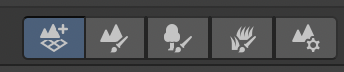

1. 첫번째 아이콘은 Create Neighbor Terrain으로 주변 터레인을 확장하고 싶을때 사용한다.

2. 두번째 아이콘은 Paint Terrain으로 Set Height, Paint Hole(입구 등 터레인 비울때 사용), Stamp Terrain등 옵션등이 있다.  
   그중에 Paint Texture를 사용하면 터레인에 색을 입혀줄수 있다. 아래 이미지처럼 여러 이미지를 추가한다면 다음과 같이 색을 덮을 수 있다. 값을 Material에 대한 값을 조정할 수있다.(Metalic, Smoothness...)  
   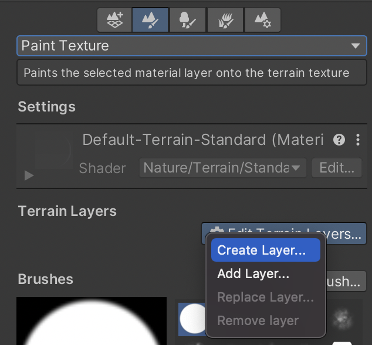 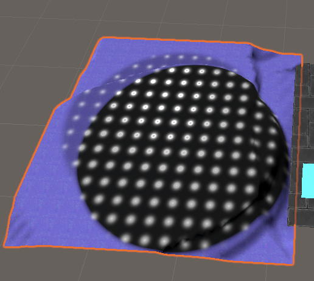  
   더욱 자세한 터레인 툴은 아래 링크와 같다.  
   [Paint Terrain 속성들](https://docs.unity3d.com/kr/2018.4/Manual/terrain-Tools.html)

3. 세번쨰 아이콘은 Paint Tree 아이콘이다. edit tree를 눌러주고 Add new tree를 해주면 새로운 Tree를 추가해 줄 수 있다.  
   추가해주면 뜨는 설정인 bend tree는 나무가 바람등에 미치는 영향들을 나타내는 수치값이다.  
   Tree Height옵션에서 높이를 랜덤으로 하는등 여러가지 옵션을 제공한다.  
   나무의 documentation은 아래 링크를 따른다.  
   [Terrain-tree 속성들](https://docs.unity3d.com/kr/2018.4/Manual/terrain-Trees.html)

4. 네번째 아이콘은 Paint Grass 아이콘이다. 다만 트리와 다른점은 Tree는 Mesh Object였고, Grass는 Billoard Object이다.(mesh로 할순있지만 많은양의 메모리를 차지하므로 비추)  
   풀은 너무 많은 메모리를 잡아먹을 수 있으므로, edit details를 이용해 texture를 수정해주며 적용하자. Edit Details에는 건강한풀의 색상, 마른풀의 색상들을 설정해 줄수도 있다.

5. 가장 오른쪽 아이콘은 Settings 아이콘이다. 터레인크기, 트리, 풀의 흔들림 등 속성이 다양하므로 아래 링크를 참조하자.  
   [Terrain 속성](https://docs.unity3d.com/kr/2018.4/Manual/terrain-OtherSettings.html)

**외전 : 트리, 및 풀등의 움직이는 방향을 조정해주고 싶으면 Hierarchy 창에서 Wind Zone을 선택해주고 바람의 방향을 선택해주면 된다. Wind Zone은 폭발등 구현할 때에도 사용된다.**

#### 7. Navigation

기본적인 NavMesh는 위에 캐릭터 이동을 하면서 알아 보았고, 여기서는 다른 기능들을 알아보자  
1.Off Mesh Link  
흔히 말하는 점프를 할때 사용된다. OffMeshLink를 Component에 넣어주고 시작지점과, 끝나는 지점을 선택해주면, 캐릭터가 이동할때 해당 지점을 통해 점프를 하여 이동한다.
**Navigation->Bake할때 Gernerated Off Mesh Links 에서 Drop Height와 Jump Distance를 값을 잘 지정해주면 알아서 Off Mesh Link를 생성해준다.**  
[OffMeshLink 속성 및 설명](https://docs.unity3d.com/kr/530/Manual/class-OffMeshLink.html)

2. Nav Mesh Obstalce  
   동적인 장애물을 만들어줄때 사용한다. 한 Object에 이 컴포넌트를 달아주면 자동으로 이동할 수 없는 장애물이 된다. 부하를 줄여주려면, Carve를 체크하고, Time To stationary를 줄여주면된다. 세부 컴포넌트 구조는 아래 링크와 같다.  
   [nav mesh obstacle](https://docs.unity3d.com/kr/560/Manual/class-NavMeshObstacle.html)  
   특정 아이템을 먹었을때 문이 열린다든지의 레벨을 구현할때 사용할 수 있다.

#### 8. GetComponent에 대한 오해(나만...?)
이거는 약간 해프닝 같은건데 나는 GetComponent가 GameObject들만 사용할 수 있는줄 알았다...  
``` csharp
    override public void OnStateExit(Animator animator, AnimatorStateInfo stateInfo, int layerIndex)
    {
        animator.GetComponent<EnemyController_Ghoul>()?.StateMachine.ChangeState<IdleState>();      
    }
```   
이 코드를 보고 찾아보니 Monobehaviour를 상속받은 모든것들은 GetComponent와 같은것을 사용 할 수 있더라.  
즉 해당 animator가 붙은 오브젝트에 EnemyController_Ghoul에 들어가는 것이다.  
  
