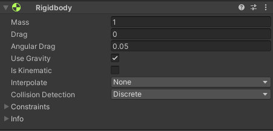

# Unity_ActionRPG
유니티로 ActionRPG(Diable등) 게임 제작하기

지금까지 유니티를 개인적으로 공부해왔지만, 하나같이 프로젝트를 직접 만들어보면서 해본것이라 간단한 컴포넌트 조차 제대로 짚고 넘어갈 기회가 없었다.
예를들어 rigidbody컴포넌트는 그동안 셀수없이 써봤지만 그 안에 Is Kinematic같은것은 정확히 어떤역할을 하는지 몰랐다.
이 참에 그동안 간과했던 하나하나 짚고 여기에 적어보려 한다. 

__프로젝트 설명__  에는 프로젝트를 만들면서 사용한 기술, 코드의 큰 맥락등을 분석한것을 적을것이며,  
__공부내용__  에는 내가 그동안 무심코 지나치며 적용했던 것들을 적어보며 복습한다.

## 프로젝트 설명

움직임은 2가지 모두 구현해 놓았다  

    1. rigidbody를 통한 움직임 [rigidbodyCharacter.cs](./ActionRPG/Assets/RigidBodyCharacter.cs)  
    
    2. characterController를 통한 움직임
        [characterController.cs]()  
        
보통의 게임에서는 간단한 플레이어 움직임은 물리엔진을 사용하지 않고 2번방식을 자주 사용한다.  
여기선 공부목적도 있어 1번을 구현하되, 플레이어의 움직임은 2번으로 한다.  

rigidbody에 설명은 아래 (새로이 알게된것 -> 2.rigidbody 컴포넌트 구성을 알아보자) 참조.  

---
__rigidbody 이동,점프 및 대쉬__  

설명에 앞서 사용하는 변수명 및 초기값은 아래와 같다.
```csharp
    #region Variables
    public float speed = 5f;
    public float jumpHeight = 2f;
    public float dashDistance = 5f;
    private Rigidbody rb;
    private Vector3 inputDirection = Vector3.zero;  // 사용자의 입력에 대한 방향성을 계산하기위한 변수
    private bool isGround = false;                  // 땅에 닿아있는지 확인하기 위한 변수
    public LayerMask groundLayerMask;               // raycast를 통해 땅에 닿아있는지 확인하기 위한 변수
    public float groundCheckDistance = 0.3f;
    #endregion Variables
```
__이동__ :
``` csharp
    <--------- update 문 중 일부 --------->
    inputDirection = Vector3.zero;      // 초기화
    inputDirection.x = Input.GetAxis("Horizontal"); // 좌우에 대한 입력값
    inputDirection.z = Input.GetAxis("Vertical");   // 앞뒤에 대한 입력값
    if(inputDirection != Vector3.zero)
    {
        transform.forward = inputDirection; // transform.forward 는 앞쪽을 바라보는 방향으로 로컬 좌표계를 회전시킴.
    }
    <--------- update 문 종료 --------->
    
    <---------FixedUpdate문 중 일부 --------->
    rb.MovePosition(rb.position + inputDirection * speed * Time.fixedDeltaTime);
    <---------FixedUpdate 종료 ---------->
    
```
이동에 대한 설명은 밑쪽 공부내용 - 3,4번 항목을 참조한다
__점프__:
rigidbody에서 jump는 Vector3.up 방향으로 점프값에 physics.gravity.y에 -2f를 곱해줬다 (physics.gravity.y 는 음수값) 게임마다 구현하는 방식이 다르므로 참조만 한다.
 
``` csharp
    <--------- update 문 중 일부 --------->
    isGroundedCheck();
    if(Input.GetButtonDown("Jump") && isGround)
    {
        Vector3 JumpVelocity = Vector3.up * Mathf.Sqrt(jumpHeight * -2f * Physics.gravity.y); // 점프공식이다. 게임마다 구현방식이 다르다.
        rb.AddForce(JumpVelocity, ForceMode.VelocityChange); // 점프를 위한 힘을 가한다. VelocityChange는 힘을 가하는 방식이다.
    }
    <-------- update 문 종료 -------->
```
isGroundedCheck()는 아래와 같다.
isGroundedCheck()에서는 특정 LayerMask를 검출해 그것에 raycast가 닿으면 true반환, 아니면 false반환 하는 방식을 사용했다.


``` csharp

    #region Helper Methods

    private void isGroundedCheck()
    {
        RaycastHit hit;

#if UNITY_EDITOR    // 유니티 에디터에서만 실행
    Debug.DrawLine(transform.position + (Vector3.up * 0.1f), // 시작점
        transform.position + (Vector3.up * 0.1f) + (Vector3.down * groundCheckDistance), // 시작점에서 땅방향으로 + groundCheckDistance(끝점)
        Color.red); // 색상
    
#endif
        
        if(Physics.Raycast(transform.position + (Vector3.up * 0.1f),    // 발에서 살짝 떨어뜨려서 raycast를 쏜다. 추후 발이 뭍히는 지형에서도 원활히 감지하기 위함
            Vector3.down,                                               // 아래 방향으로
            out hit,                                                    // hit에 정보를 담는다.
            groundCheckDistance,                                        // 땅에 어느정도 가까워 졌을때 감지할지
            groundLayerMask                                             // 땅에 대한 레이어마스크
        )) isGround = true;
        else isGround = false;

    
    }
    #endregion Helper Methods
```
__대시__:
대시에 대한 함수는 다음과 같다.
``` csharp
    <--------- update 문 중 일부 --------->
    if(Input.GetButtonDown("Dash"))
    {
        Vector3 dashVelocity = Vector3.Scale(transform.forward,
            dashDistance * new Vector3(Mathf.Log(1f/(Time.deltaTime * rb.drag + 1 ))/ -Time.deltaTime, 
            0,
            (Mathf.Log(1f/(Time.deltaTime * rb.drag + 1 ))/ -Time.deltaTime)
            )
        );
        rb.AddForce(dashVelocity, ForceMode.VelocityChange);
    }
    <--------- update 문 종료 --------->
```
여기선 dashVelocity를 구하는데 Vector3.Scale를 통해서 방향벡터를 스케일링 했다.
Vector3.Scale은 두개의 벡터를 받아서 각 구성요소를 곱한후 반환하는 것으로, 여기선 첫번째 인자로, transform.forward(사용자가 바라보는 방향)를 받아왔고, 이를 두번째 인자에 곱해 스케일링한다.
두번째는 스케일링할 벡터를 생성해 주었다. 스케일링할 벡터는 log를 분모로 하고 저항값을 가져와 1을 더한다거기에 deltaTime을 곱해줬다. 대시는 처음에 빨랐다가, 느려지는게 좋을거 같아서
저런식으로 구현했다. 다만 대시또한 게임마다 구현하는 방법이 다르므로 다른자료를 참조만 했다.  

AddForce 의 두번째 인자는 ForceMode이다. 여기서는 ForceMode.VelocityChange를 사용했는데 이는 순간적으로 뒤에서 밀듯이 힘을 붙여주는것이다.   
이밖에도 엑셀을 밟듯 가속을하는 ForceMode.Force   
똑같이 가속을하지만 무게를 무시하는 ForceMode.Accelertion  
순간적으로 힘을주는 ForceMode.Impulse  
순간적으로 힘을주지만 무게를 무시하는 ForceMode.VelocityChange  

---

__CharacterController를 이용한 이동__

## 공부내용.

1. 정적 오브젝트


ground 와 같이 움직이지 않는것들은 static을 표기해주는 것이 좋다. 이는 정적 오브젝트가 포지션 변화로 인해 무효화 될일이 없다는것을 체크해주는것으로,
여러 정적 오브젝트들을 배치(batch) 라는 하나의 큰 오브젝트로 결합시킴으로서 렌더링을 최적화 할수 있다.(정적 최적화)
필요에 따라 static옆에 화살표를 눌러 원하는 정적 상태를 (활성화/비활성화) 시킬수 있다. 이는 아래 링크 참조.

[정적 게임 오브젝트, 정적 설정에 대한 설명](https://docs.unity3d.com/kr/530/Manual/StaticObjects.html)

---
2. rigidbody 컴포넌트 구성을 알아보자

> rigidbody : gameobject를 물리엔진에서 제어하도록 만드는 컴포넌트이다.


<br>

- Mass : 질량이다. rigidbody끼리 충돌할때 작용하는 요소이다.

- Drag : 공기저항값이다. 값이 크면 깃털과 같이 가볍게 작용해 점프등을 할때 천천히 내려옴.

- Angular Drag : 회전을 할떄의 저항값이다.

- Use Gravity : 중력을 받을것인가

- is Kinematic : 물리엔진이 아닌 GameObject에서 짜준 로직에 따라서 이동을 해줄것인가. (즉 이것을 체크하면 외부에서 가해지는 물리적 힘에 반응하지 않는다.
보통 AddForce등과같은 물리거동을 사용하지 않는경우에는 충돌, 힘이 적용될때만 이것을 해제해주기도 한다.)

- Interpolate : 물리엔진에서의 애니메이션을 자연스레 보관을 할것인가.
~ None - Interpolate 기능을 사용하지 않는다
~ Interpolate - 이전 프레임을 기반으로 보정하여 움직임을 보정한다.
~ Extrapolate - 다음 프레임의 움직임을 추정해서 움직임을 보정한다.

- Collision Detection : 충돌감지를 설정해준다.
~ Discrete : 일반적인 충돌 감지 방식으로 모든 collider와의 충돌을 검사하여 감지한다.
~ Continuous : 배경이나 Static 등 고정되어있는 것과의 충돌을 인식할때 사용된다.
~ Continuous Dynamic : 위의 두 방식을 번갈아 사용하면서 충돌을 인식한다.
~ Continuous Speculative : Continuous Dynamic 보다 성능적으로 가볍다. 다만, 실제로 충돌을 하지 않았지만 두 물체가 충돌했다고 인식하는 경우가 발생할 수 있다고 한다.

-Constraints : rigidbody의 움직임을 제어한다.

---
3. Vector & transform
보통 우리가 사용하는 Vector3.forward 와 transform.forward를 예시로 든다. 굳이 forward에 국한되지 않고 .up, .back등에도 쓴다.
Vector3.forward는 new Vector(0,0,1) 이 기본이다. 이것은 Read-Only Value기 때문에 바꿀수 없다.
transform.forward는 현재 오브젝트를 기준으로 한다. 보통 3D에서 물체가 바라보는 방향을 바꿔주고싶으면 
```csharp
        inputDirection = Vector3.zero;      // 초기화
        inputDirection.x = Input.GetAxis("Horizontal"); // 좌우에 대한 입력값
        inputDirection.z = Input.GetAxis("Vertical");   // 앞뒤에 대한 입력값
        if(inputDirection != Vector3.zero)
        {
            transform.forward = inputDirection; // transform.forward 는 앞쪽을 바라보는 방향으로 로컬 좌표계를 회전시킴.
        }
```
와 같이 사용하곤한다.
즉 사용 용도가 완전히 다르다.
---
4. Update, FixedUpdate, LateUpdate
~ Update - 매 프레임마다 처리되는 작업이다. 때문에 그래픽 랜더링 속도에 따라 느려지거나 빨라지고 있어서, 원하지않은 물리적 충돌이 발생할 수 있다.
~ FixedUpdate - 물리엔진 위에서 동작한다. 즉 고정된 시간마다 실행하는데 이때문에 보통 이동,회전,힘에서 사용한다.
~ LateUpdate - Update문 호출이되고 가장 마지막에 호출되는 문이다

보통 이 3가지 조합을 합쳐서 
입력은 Update, 이동처리는 FixedUpdate, 카메라 움직임은 LateUpdate에 구현해주면 보다 부드럽게 구현 할 수 있다.
